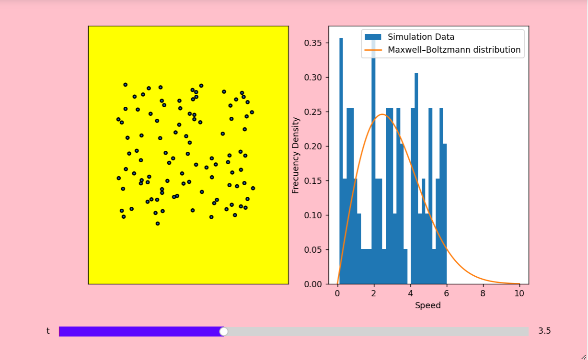

# Maxwell Boltzman Distribution

Visualiztion of "Maxwell‑Boltzman Distribution"
and "Particle Distribution in the box" for movement
of particles at different time intervals using Jupyter Notebook.


## Features

- **Time Slider:** Details of position
  and velocity of particles at different time is
  evaluated and visualizaton is changed.
- Size of Visualization can be changed.


## Demo

Insert gif or link to demo


## Screenshots




## Tech Stack

Jupyter Notebook, Python, Numpy, Pandas, Matplotlib


## Deployment

To deploy this project :

- Run the following command in cmd of the directory
```bash
  jupyter notebook
```
- Click "Restart and run all"
